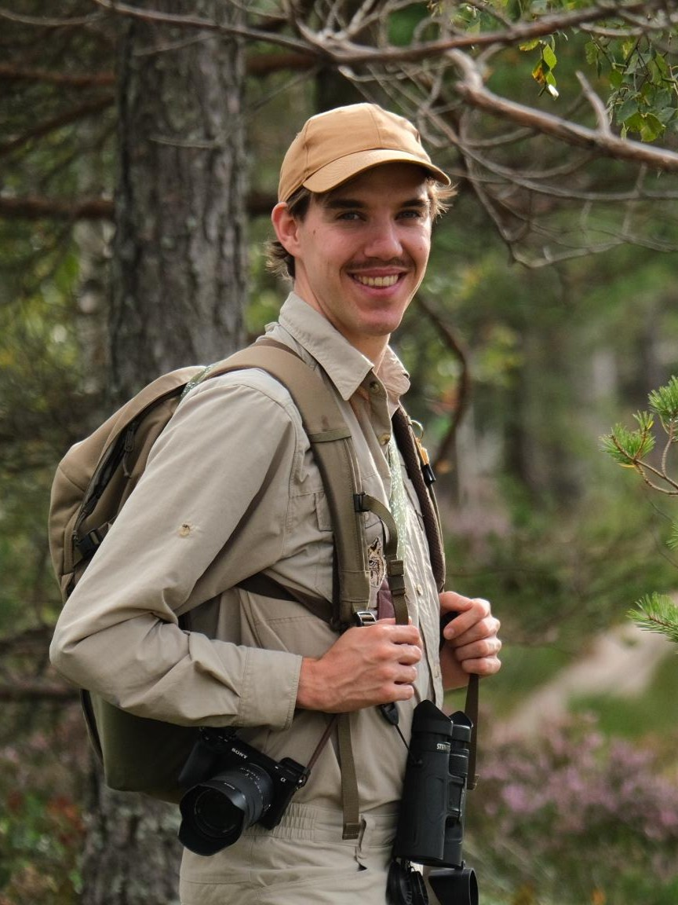
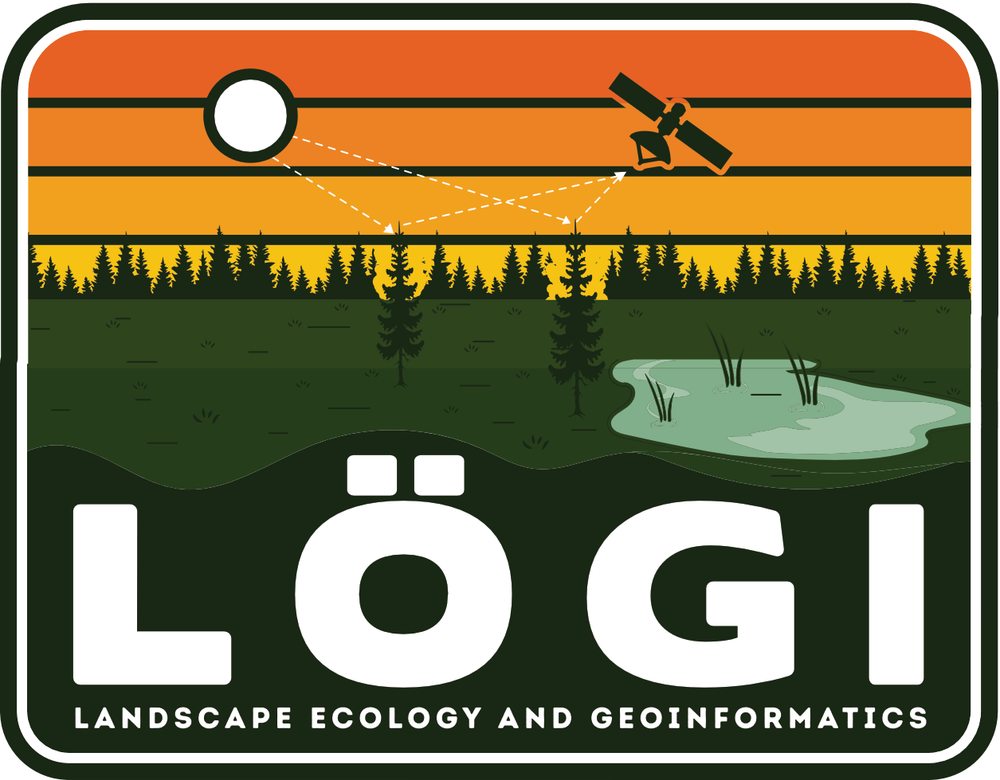
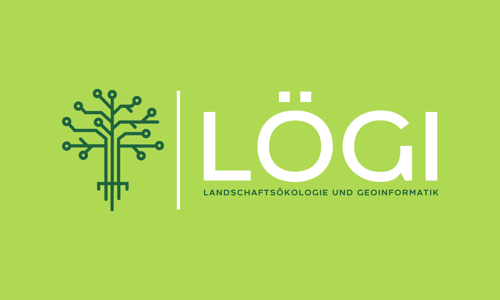

::: {.hero-image-section}

:::

# LÖGI LANDSCAPE ECOLOGY & GEOINFORMATICS {.page-title}

::: {.content-row}

::: {.content-img}

:::

::: {.content-text}
### Welcome!
Since 2022 I am working as a Freelancer in Ecological Fieldwork, Environmental Modelling and Geo data processing. 
:::

:::

::: {.content-row}

::: {.content-text}
### [Services](../pages/projects.html)
My experiences cover Botanical mappings, agricultural controls, geodata processing (R & GIS) and environmental modelling. I am specialiced in ecological restoration, remote sensing and vegetation ecology. Feel free to contact me for custom requests.
:::

::: {.content-img}

:::

:::

<!-- ::: {.content-row} -->

<!-- ::: {.content-img} -->
<!--  -->
<!-- ::: -->

<!-- ::: {.content-text} -->
<!-- ## Third Section -->

<!-- ::: -->

<!-- ::: -->

