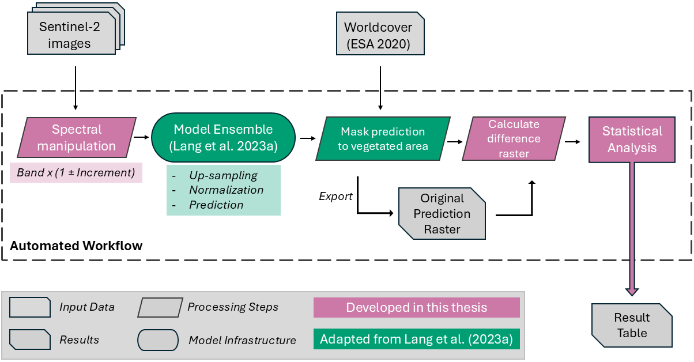
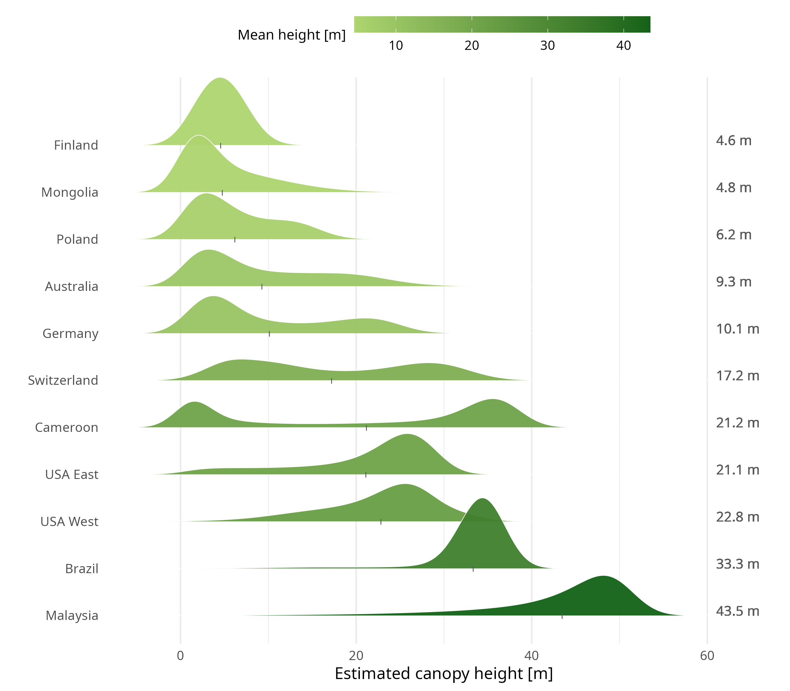

::: {.aside}
<a href="https://github.com/ESA99/canopy_height" target="_blank" class="github-button" aria-label="GitHub">
  <i class="bi bi-github"></i>
</a>
:::


## Introduction

This page documents the progress of the research on the operating mechanisms of the global canopy height model by @lang_gchm_2023. For the full data and scripts please visit the corresponding [GitHub page](https://github.com/ESA99/canopy_height) and for other projects and more information about me visit my [Main Site](https://esa99.github.io).

## Research question
The goal of this research is to understand the role of spectral data in the creation of deep learning approaches in order to predict canopy height, and generate insights to improve future approaches. The lack of a known ecological connection between spectral data and canopy height raises questions on the mechanisms driving prediction. This thesis aims to address the following question:

**Are spectral reflectance values the driving force in recent deep learning models
predicting canopy height?**  

It is hypothesized that spectral data does not contain information
about canopy height, and that other factors, like coordinates, are more relevant for prediction.


## Methods
This research builds on an existing model architecture promising global canopy height prediction [@lang_github2023], delivering high spatial resolution, easy data accessibility and reproducibility. The authors claim that the model has learned connections to spectral values as well as texture and present a remarkably low overall Root-Mean-Square-Error (RMSE) of 6.0 m. It was therefore selected to be used as an experimental subject in this research.

As we cannot retrace the reasoning of the model due to the nature of deep learning approaches and their size, the effect of spectral values has to be isolated. To address this limitation, we approach this question by deploying the selected model on systematically manipulated spectral input data to observe the resulting change in canopy height estimates. Assuming the model has learned connections to spectral values, such perturbations would be expected to change proportionally, resulting in an approximately linear explanatory relationship between the magnitude of the spectral manipulation and the corresponding change in the predicted canopy height. Consistent with the original paper, Sentinel-2 imagery [@sentinel2_2020] and ESA-WordCover data [@worldcover_2020] from 2020 was used. 

To systematically analyze the role of spectral data in deep learning models for estimating canopy height, an automated workflow was developed. This workflow encompasses data preparation, variable creation, file management, model deployment, and the export of results. @fig-methods illustrates the key elements of the process and the sequence of operations. The spectral manipulation function is integrated into the model deployment scripts. The original code of the model remained unchanged.


::: {#fig-methods}

Conceptual illustration of the developed workflow created for the analysis. Components developed as part of this thesis are highlighted in pink, adapted infrastructure originating from Lang et al. (2023a) is shown in green. The automated workflow processes one Sentinel-2 Tile at a time and repeats the process for the next manipulation step and image, after saving the results.
:::

## Research locations
In total 11 tiles were used for the analysis of the model. They were selected to be distributed globally, cover multiple different biomes and based on the presented tiles by the original paper.  

::: {#fig-tilemap}
```{r}
#| message: false
#| echo: false
#| warning: false
#| fig-width: 11
#| fig-height: 3
#| fig-column: page-right

library(tmap)
library(sf)
library(dplyr)

tiles <- st_read("../content/gchm/selected_tiles.geojson", quiet = TRUE)

tile_label <- c("55HEV" = "Australia", "20MMD" = "Brazil", "33NTG" = "Cameroon", "32UQU" = "Germany", 
                "35VML" = "Finland", "49NHC" = "Malaysia", "49UCP" = "Mongolia", 
                "34UFD" = "Poland", "32TMT" = "Switzerland", "10TES" = "USA East", "17SNB" = "USA West")


tiles <- tiles %>%
  mutate(Location = tile_label[Name])

tmap::tmap_mode("view")
tmap::tm_shape(tiles) +
  tmap::tm_borders(col = "red", lwd = 2) +
  tmap::tm_text("Location", size = 0.8, col = "grey95")+
  tmap::tm_view(
                basemaps = c("Esri.WorldImagery", "CartoDB.DarkMatterNoLabels"),
                set.view = c(10.0, 20.0, 2))  # longitude, latitude, zoom level

```
Sample tiles selected for the Analysis.
:::

## Results

```{r}
#| label: fig-lineplot
#| fig-cap: "Average relative difference [%] by absolute manipulation degree for each manipulated band."
#| message: false
#| echo: false
#| warning: false
#| fig-width: 12
#| fig-height: 8

library(dplyr)
library(ggplot2)
library(ggpubr)
library(ggrepel)
library(viridis)

result_table <- read.csv("../content/gchm/2025-10-20_main.csv")

cbf_colors <- c(Blue= "#0072B2", Green = "#009E73", Red= "#D55E00", RedEdge  ="#CC79A7",NIR= "#9E0142", NIR2 = "#5E4FA2", SWIR1= "#E6AB02", SWIR2 = "#999999")


label_data <- result_table %>%
  group_by(band, abs_increment) %>%
  summarise(avg_difference_percent = mean(avg_difference_percent),
            .groups = "drop") %>%
  group_by(band) %>%
  filter(abs_increment == max(abs_increment))


ggplot(result_table, aes(x = abs_increment, y = avg_difference_percent,
                         color = band, fill = band)) +
  stat_summary(fun = mean, geom = "line", linewidth = 1.2) +
  stat_summary(fun.data = mean_se, geom = "ribbon", alpha = 0.2, color = NA) +
  geom_text_repel(data = label_data,
                  aes(label = band),
                  direction = "y",
                  hjust = 0,
                  nudge_x = 0.5,
                  segment.color = NA,
                  size = 4,
                  show.legend = FALSE) +
  scale_color_manual(values = cbf_colors,  breaks = c("Blue", "NIR2", "NIR", "Green","SWIR2", "Red", "SWIR1", "RedEdge")) +
  scale_fill_manual(values = cbf_colors, breaks = c("Blue", "NIR2", "NIR", "Green", "SWIR2", "Red", "SWIR1", "RedEdge")) +
  scale_x_continuous(expand = expansion(mult = c(0.02, 0.15))) +
    labs(x = "Manipulation Degree [%]", y = "Average Relative Difference [%]") +
  theme_minimal(base_size = 14) +
  theme(legend.position = "none") +
  coord_cartesian(clip = "off")

```

The preliminary results already show no clear trend after spectral manipulation (Fig. 1). Differences between locations have shown to be more significant than spectral manipulation, suggesting that the actual influence of spectral properties in the creation of the prediction is very low or none. Relationships between the location of the image tile and the predicted canopy height could already be observed. They will be properly analysed and shown at a later stage of this project. See @fig-CHridge


::: {#fig-CHridge}
)
Distribution of predicted canopy height per tile. Sorted by mean canopy height in meters,
across the whole tile
:::

:::{.column-margin}
TEST Content to fit into the page margin. This can be any content, even a figure or equation.
:::


```{r}
#| label: fig-tileband
#| fig-cap: "Single band by tile"
#| message: false
#| echo: false
#| warning: false
#| fig-width: 11
#| fig-height: 10

library(plotly)
library(dplyr)
library(ggplot2)

result_table <- result_table %>%
  mutate(Location = as.character(Location))

legend_order <- result_table %>%
  group_by(Location) %>%
  summarise(mean_val = mean(average_difference, na.rm = TRUE)) %>%
  arrange(desc(mean_val)) %>%
  pull(Location)

result_table <- result_table %>%
  mutate(Location = factor(Location, levels = legend_order))

bands <- unique(result_table$band)

colors <- c(Blue = "#0072B2", Green = "#009E73",Red = "#D55E00",RedEdge = "#CC79A7",NIR = "#9E0142",  NIR2 = "#5E4FA2", SWIR1 = "#E6AB02",SWIR2 = "#999999")


p <- plot_ly()

trace_index <- 0
visibility_matrix <- list()


for (b in bands) {

  df_b <- result_table %>% filter(band == b)

  for (loc in levels(result_table$Location)) {

    df <- df_b %>% filter(Location == loc)

    # Ribbon (upper bound)
    p <- add_ribbons(
      p,
      data = df,
      x = ~increment,
      ymin = ~average_difference - std_dev,
      ymax = ~average_difference + std_dev,
      fillcolor = adjustcolor(colors[b], alpha.f = 0.25),
      line = list(width = 0),
      showlegend = FALSE,
      visible = (b == bands[1])
    )
    trace_index <- trace_index + 1

    # Line
    p <- add_lines(
      p,
      data = df,
      x = ~increment,
      y = ~average_difference,
      colors = colors,
      showlegend = FALSE,
      visible = (b == bands[1]),
      line = list(width = 2)
    )
    trace_index <- trace_index + 1

    # Points
    p <- add_markers(
      p,
      data = df,
      x = ~increment,
      y = ~average_difference,
      color = ~Location,
      colors = colors,
      showlegend = FALSE,
      visible = (b == bands[1])
    )
    trace_index <- trace_index + 1
  }
}

#Build Dropdown
n_traces_per_band <- length(levels(result_table$Location)) * 3

buttons <- lapply(seq_along(bands), function(i) {

  vis <- rep(FALSE, length(bands) * n_traces_per_band)

  start <- (i - 1) * n_traces_per_band + 1
  end <- i * n_traces_per_band

  vis[start:end] <- TRUE

  list(
    method = "update",
    args = list(list(visible = vis)),
    label = bands[i]
  )
})

# Final clean UI
p <- layout(p,
  xaxis = list(title = "Manipulation [%]"),
  yaxis = list(title = "Average Difference [m]"),
  updatemenus = list(
    list(
      type = "dropdown",
      x = 0.02,
      y = 1.15,
      buttons = buttons
    )
  )
)

p <- layout(
  p,
  autosize = TRUE,
  margin = list(l = 0, r = 0, t = 50, b = 50)
)

p <- config(p, responsive = TRUE)

p

```


```{r}
#| label: fig-tilefacett
#| fig-cap: "Difference to original prediction after manipulating single bands, shown by sample tile"
#| message: false
#| echo: false
#| warning: false
#| fig-width: 12
#| fig-height: 16

ggscatter(result_table, 
          # x = "increment",
          x = "abs_increment",
          y = "average_difference",
          # y = "avg_difference_percent",
          color = "band", 
          fill = "band",
          alpha = 0.6,
          size = 2,
          add = "loess", 
          add.params = list(se = TRUE, alpha = 0.2, span = 0.3),
          facet.by = "Location", 
          scales = "fixed",
          ncol = 3,
          palette = cbf_colors) +
  geom_hline(linetype = "dashed",
             yintercept = c(-10, -5, 5, 10),       # Absolute differences
             # yintercept = c(-100, -50, 50, 100),   # relative Difference
             color = "grey85", 
             linewidth = 0.6) +
  geom_hline(yintercept = 0, 
             linetype = "dashed", 
             color = "grey30") +
  labs(x = "Manipulation Degree [%]",
       y = "Mean Difference [m]",
       # y = "Mean Difference [%]",
       color = "Band",
       fill = "Band") +
  theme_pubr(base_size = 14) +
  theme(legend.title = element_text(size = 12, face = "bold"),
        # legend.position = "right",
        legend.position = c(0.86, 0.06),   # x = 0.95 (right), y = 0.05 (bottom)
        legend.text = element_text(size = 10),
        legend.direction = "horizontal",
        legend.box = "vertical",                     # allows title above
        legend.spacing.x = unit(0.5, "cm"),         # horizontal spacing between keys
        legend.key.size = unit(1, "cm"),            # size of legend keys
        legend.margin = margin(5, 5, 5, 5),         # padding inside legend box
        legend.box.just = "center"                   # center legend in the box
  ) +
  guides(
    color = guide_legend(
      title.position = "top",                  # title above
      nrow = 4,                                # number of rows
      byrow = TRUE,                            # fill rows first
      label.position = "bottom",               # labels below keys
      keywidth = unit(1.3, "cm"),               # width of keys
      keyheight = unit(0.5, "cm")             # height of keys
    ),
    fill = guide_legend(
      title.position = "top",
      nrow = 4,
      byrow = TRUE,
      label.position = "bottom",
      keywidth = unit(1, "cm"),
      keyheight = unit(0.5, "cm")
    )
  )

```


## Slides

<!-- [Here](/content/gchm/presentation_slides.pdf) can you find the presentation of the ILÖK Graduate Conference. -->

<a href="/content/gchm/presentation_slides.pdf" class="btn btn-primary" target="_blank">Conference slides (PDF)</a>


<!-- ## Sources -->

<!-- Lang, N., Jetz, W., Schindler, K., & Wegner, J. D. (2023).   -->
<!-- A high-resolution canopy height model of the Earth.   -->
<!-- Nature Ecology & Evolution, 1-12.   -->

<!-- ```          -->
<!-- @article{lang2023high, -->
<!--   title={A high-resolution canopy height model of the Earth}, -->
<!--   author={Lang, Nico and Jetz, Walter and Schindler, Konrad and Wegner, Jan Dirk}, -->
<!--   journal={Nature Ecology \& Evolution}, -->
<!--   pages={1--12}, -->
<!--   year={2023}, -->
<!--   publisher={Nature Publishing Group UK London} -->
<!-- } -->
<!-- ``` -->

