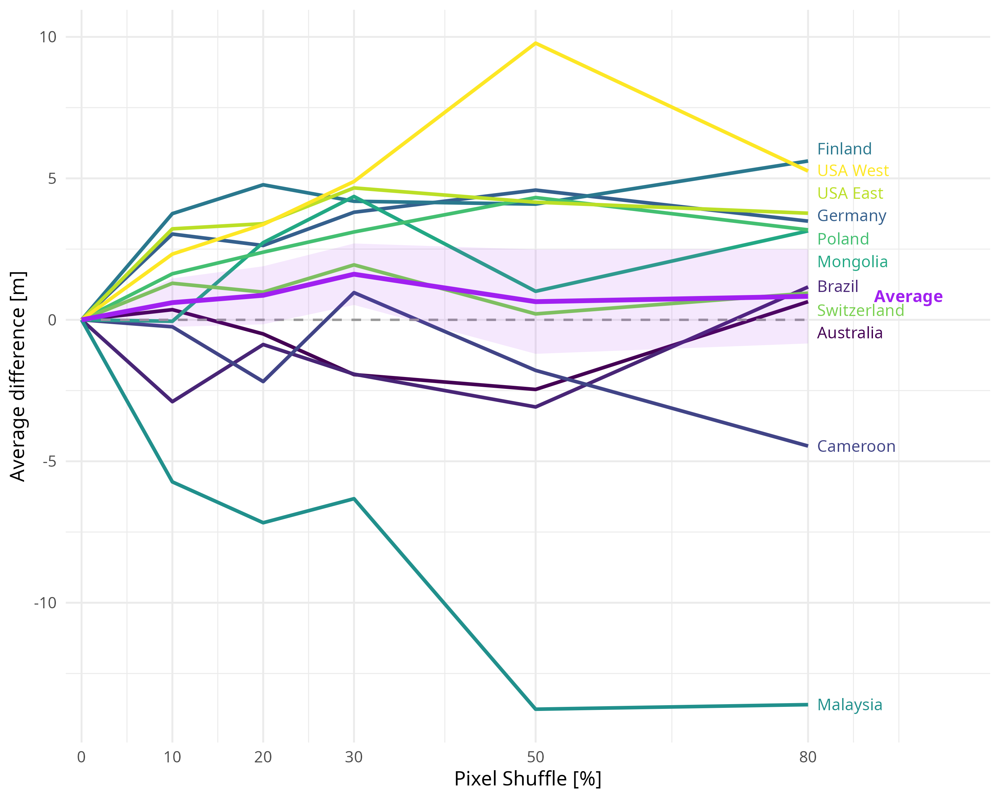
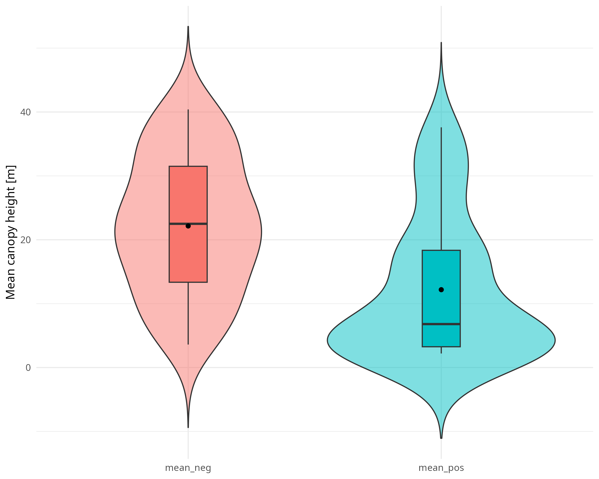

::: {.project-nav}
<a href="gchm.qmd" class="project-nav-link">
  <span class="project-nav-arrow">←</span>
  <span class="project-nav-text">
    Previous research: Thesis on the influence of spectral values
  </span>
</a>
:::

## Introduction
The global canopy height model [@lang_github2023] predicts canopy heigth using only spectral imagery as input data. The authors claim the model has learned spectral and textural features, while also including geographical coordinates [@lang_gchm_2023]. The first aspect has been analysisd in my [Thesis](gchm.qmd), while Vinzenz HD Zerres analysed the role of latitude on prediction. Here the influence of texture is analysed and documented.


## Texture Manipulation

To isolate the effect of texture on prediction, a systematic manipulation of the input data is performed (See [spectral methods](../pages/gchm.html#methods)). Pixels were shuffled across individual Sentinel-2-Scenes in their X and Y dimension while keeping the spectral bands (Z dimension) aligned. Two separate manipulations were performed and compared, once shuffling the pixels across the whole Scene and once shuffling pixels within a local 512x512 subtile, keeping global context but changing local texture. The manipulation was performed to different degrees ranging from 10&nbsp;% to 80&nbsp;% shuffled pixels.


### Global pixel shuffle

The effects of texture manipulation to different degrees are illustrated both on average and for all individual sample tiles in @fig-AvgDiff. On average there is no meaningful difference with a very weak positive change across all manipulation degrees. Between the sample tiles big differences are visible, with Malaysia having a strong negative response and USA&nbsp;West and Finland showing the highest positive responses.

```{R}
#| label: fig-AvgDiff
#| fig-cap: "Average signed difference to original prediction in meters, by tile and average across all tiles combined."
#| fig-width: 10
#| echo: False
#| 

```


The average initial canopy heights show a very different distribution based on their response after manipulation. Areas showing an increase in prediction have a lower average initial canopy height while negative responses could be observed more in higher initial canopy heights.

```{R}
#| label: fig-CHviolin
#| fig-cap: "Mean canopy height split by direction of response after manipulation. Negative difference in red and positive difference in blue."
#| fig-width: 10
#| echo: False
#| 

```


### Local pixel shuffle


## Technical implementation


