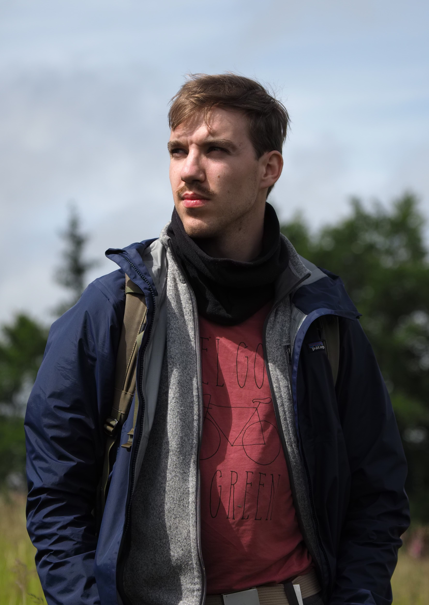

::: {.grid .gx-5}

::: {.g-col-12 .g-col-md-4 .text-center}

{.cv-photo}  

**Emilio Sánchez**  
_M.Sc. Landscape Ecology_  
<!-- esanchez@uni-muenster.de   -->
<!-- +123 456 7890 -->

  <a href="https://github.com/ESA99"><i class="bi bi-github"></i></a>
  <a href="https://orcid.org/0009-0004-0348-5434"><i class="ai ai-orcid"></i></a>
  <a href="mailto:esanchez@uni-muenster.de"><i class="bi bi-envelope-fill"></i></a>

<!-- ### Languages -->

<!-- 
 -->
<!-- German -->
<!-- 
 -->
<!-- 

 -->
<!-- 
 -->
<!-- 
 -->

<!-- 
 -->
<!-- English -->
<!-- 
 -->
<!-- 

 -->
<!-- 
 -->
<!-- 
 -->

<!-- 
 -->
<!-- Spanish -->
<!-- 
 -->
<!-- 

 -->
<!-- 
 -->
<!-- 
 -->

<!-- 
 -->
<!-- Swedish -->
<!-- 
 -->
<!-- 

 -->
<!-- 
 -->
<!-- 
 -->

<!-- ### Programming -->

<!-- 
 -->
<!-- R -->
<!-- 
 -->
<!-- 

 -->
<!-- 
 -->
<!-- 
 -->

<!-- 
 -->
<!-- Git -->
<!-- 
 -->
<!-- 

 -->
<!-- 
 -->
<!-- 
 -->

<!-- 
 -->
<!-- Python -->
<!-- 
 -->
<!-- 

 -->
<!-- 
 -->
<!-- 
 -->

<!-- 
 -->
<!-- CSS -->
<!-- 
 -->
<!-- 

 -->
<!-- 
 -->
<!-- 
 -->

### Languages

  German
  

  English
  

  Spanish
  

  Swedish
  

### Programming

  R
  

  Git
  

  Python
  

  CSS
  

:::

::: {.g-col-12 .g-col-md-8}
## About
My Name is Emilio Sánchez and I am a landscape ecologist from Germany with specialization in remote sensing, machine learning and botany.

---

### Education

**M.Sc. Landscape Ecology**   
Oct 2023-Present · [University Münster](https://www.uni-muenster.de/Landschaftsoekologie/en/index.shtml)     
Focus: *Remote Sensing, Restoration Ecology, Soil Ecology*   
Thesis: *Canopy height mapping from optical remote sensing data: reassessing deep learning methods.*    

**B.Sc. Landscape Ecology**  
Oct 2019-Sep 2022 · [University Münster](https://www.uni-muenster.de/Landschaftsoekologie/en/index.shtml)     
Thesis: *Spatio-temporal analysis of a central European bog.*    

<!-- | [University Münster](https://www.uni-muenster.de/Landschaftsoekologie/en/index.shtml) _(Oct 2019 - Sep 2022)_   -->
<!-- Thesis: *Spatio-temporal analysis of a central European bog.*  -->

---

### Experience

**Field Inspector**  | Freelance  
2022–Present · Control of agricultural fields

<!-- **Field Inspector** | Freelance   -->
<!-- _Annualy since 2022_   -->
<!-- Control of agricultural fields.  -->

**Student Assistant** | Institute of Landscape Ecology  
Sep 2025 - Feb 2026 · Analysis of deep learning models  

**Student Assistant** | Institute of Landscape Ecology  
Apr - Sep 2023 · Botany tutor  

**Ecological Mapping** | LAKI GBR  
May - July 2022 · Ecological mappings of vegetation.    

**Student Assistant** | Institute of Landscape Ecology  
Apr - Sep 2022 · Field Equipment rental  

**Intern** | EFTAS Remote Sensing  
Oct - Nov 2021 · Machine learning and reproducible workflows.  

---

### Memberships

- Floristisch-soziologische Arbeitsgemeinschaft e.V. (FlorSoz)

---

### Skills

- Processing of ecological- and spatial data 
- Data analysis and visualization
- Scientific writing
- Organisational talent
- Project Management (University training)

---

### Activities

- Volunteer at THW (Federal Agency for Technical Relief)
- Sports  
    - Biking and trail running  
    - Team sports at University  
- Woodworking
- Gardening
- DIY-Projects

:::

:::

