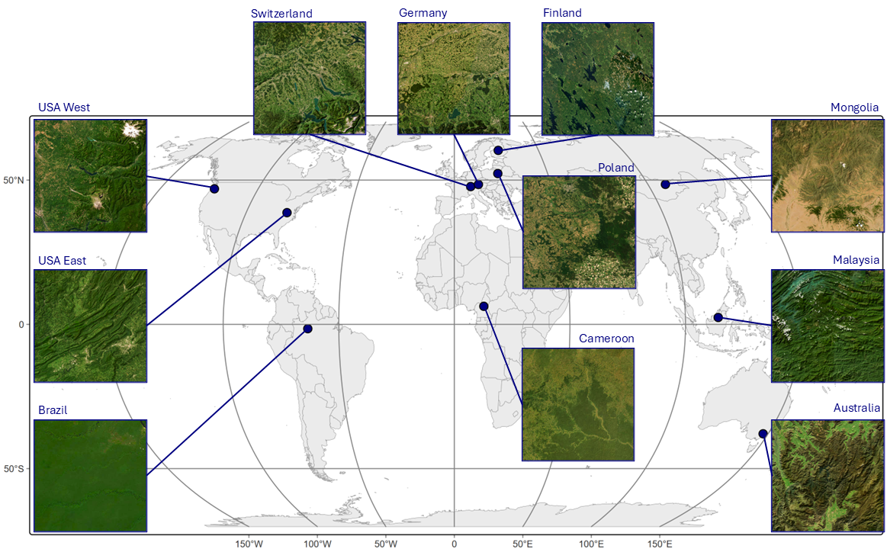
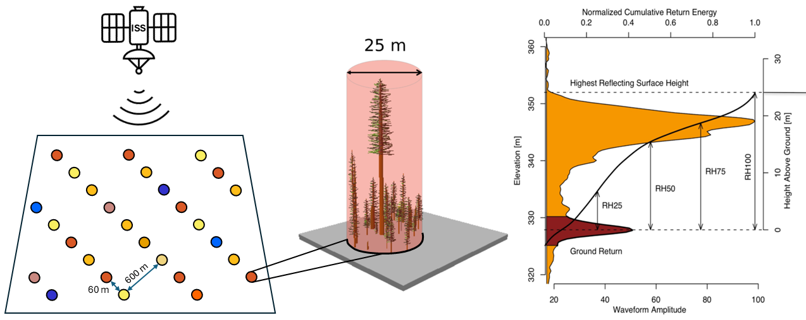

## Research Question

**Are spectral reflectance values the driving force in recent deep learning models predicting canopy height?**

---

## Sample Tiles

---

## Model training

::: columns
::: column

:::
::: column
- Location description
- Key variables
- Data sources
:::
:::

---

## Results

Some key finding here [@lang_gchm_2023].

::: {.footer}
::: {.smaller}
::: {#refs}
:::
:::
:::

---

## Thank You

Questions?
